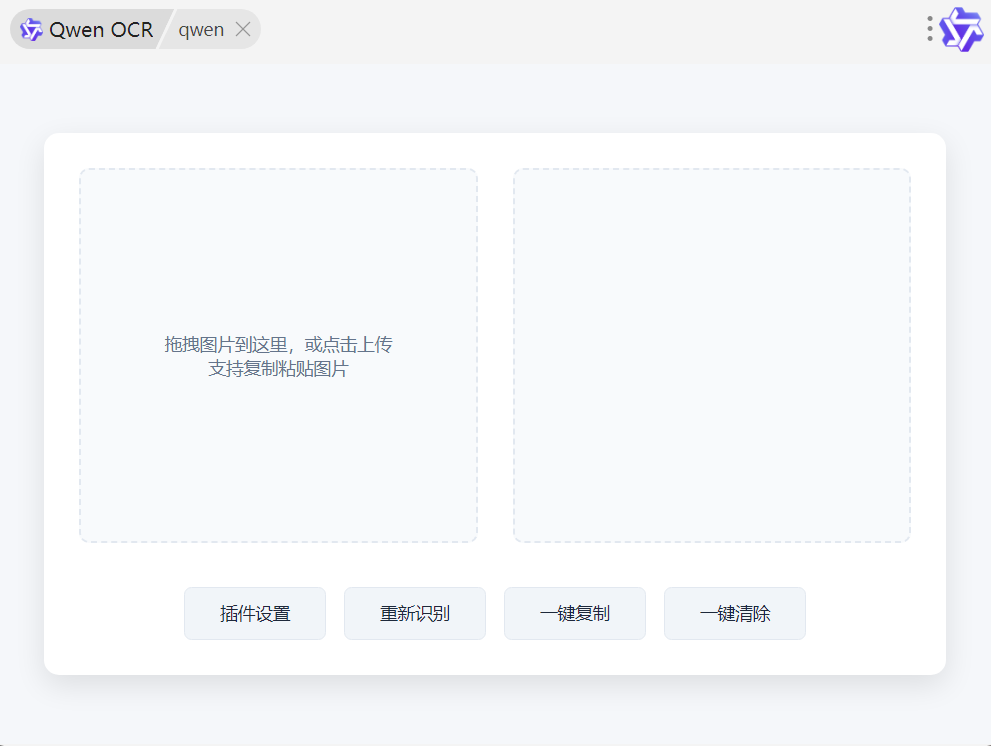
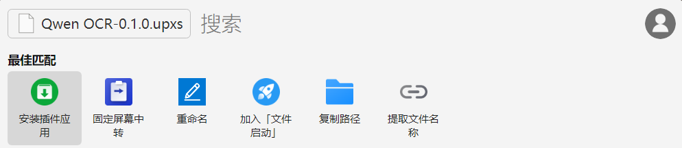
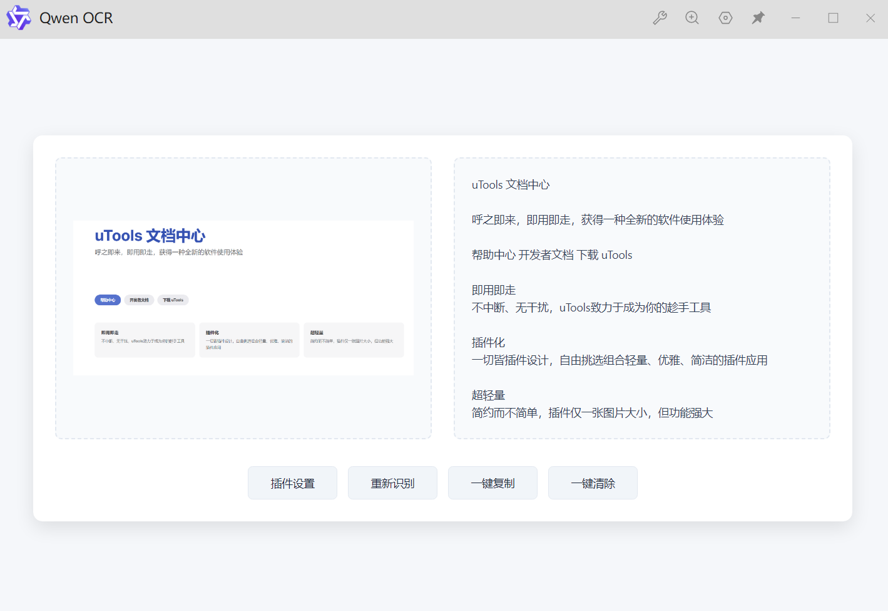
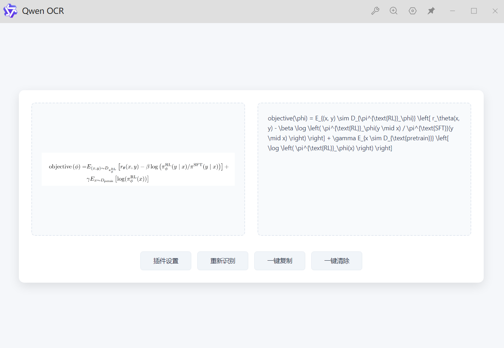
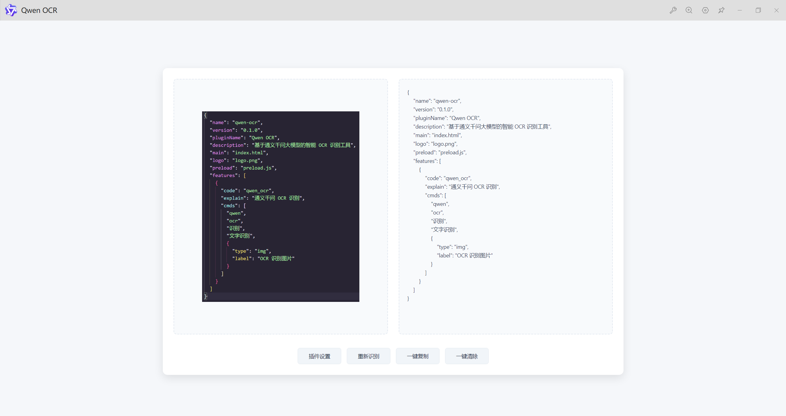
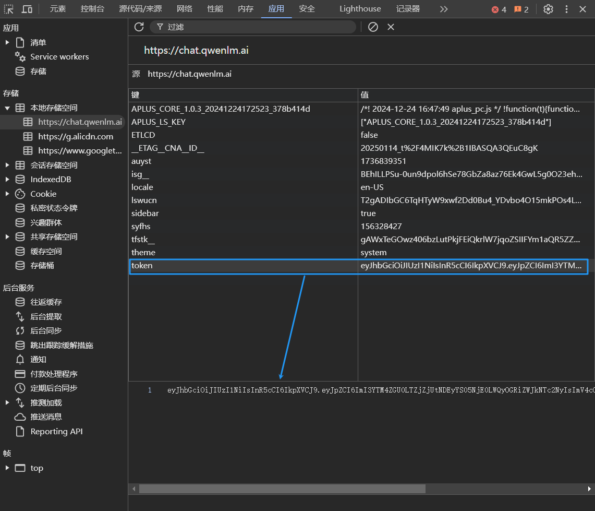

# 🔍 Qwen OCR - uTools 插件

> 🤖 基于通义千问大模型的智能 OCR 识别工具

## 项目展示

## ✨ 特性

- 🎯 精准的文字识别能力
- 📐 完美支持数学公式（自动转换为 LaTeX 格式）
- 💻 代码块智能识别
- 🌙 自动适配深色模式
- ⚡️ 快速响应，支持多种图片输入方式
- 🔄 支持多个 API Token 轮换使用
- 📝 可自定义识别 Prompt
- 📋 一键复制识别结果
- 🔄 支持重新识别
- ⚙️ 可配置的识别参数

## 📥 安装方法

1. 下载插件安装包
2. 选中安装包，按下 Ctrl + C 复制
3. 再按下 Alt + 空格键呼出 uTools
4. 将安装包粘贴到搜索框中，选择"安装插件/应用"

## 🚀 使用方法

1. ⌨️ 通过 uTools 关键字呼出插件：
   - `qwen`
   - `ocr`
   - `识别`
   - `文字识别`
2. 🔑 打开插件，点击"插件设置"配置通义千问 API Token
3. 选择以下任意方式输入图片：
   - 🖼️ 拖拽图片到识别区域
   - 📋 复制图片后直接粘贴
   - 📤 点击识别区域上传图片

## 🎨 功能展示

### 文本识别

### LaTeX 公式识别

### 代码识别

## ⚙️ 配置说明

1. 获取通义千问 API Token：
   - 访问 [通义千问开放平台](https://chat.qwenlm.ai)
   - F12 打开控制台-应用，token 字段就是需要的 key

2. 配置插件：
   - 点击插件界面的"插件设置"
   - 填入 API Token（支持多个 Token，用英文逗号分隔）
   - 可选：自定义识别 Prompt

## 📝 注意事项

- 🔒 请妥善保管你的 API Token
- 🌐 使用时需要确保网络连接正常
- 📊 建议使用清晰的图片以获得最佳识别效果

## 🤝 贡献

欢迎提交 Issue 和 Pull Request！

## 📄 许可证

MIT License

## 🙏 鸣谢

- [通义千问开放平台](https://chat.qwenlm.ai)
- [uTools](https://u.tools)
- [ocr-based-qwen](https://github.com/Cunninger/ocr-based-qwen) 